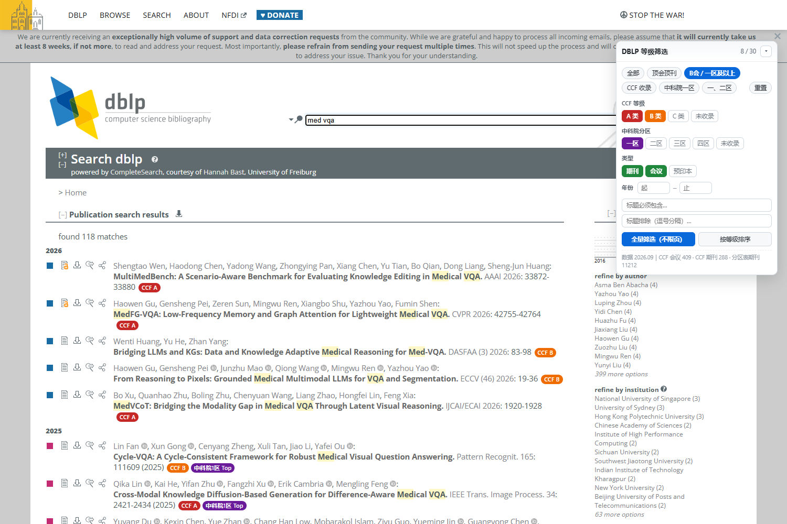
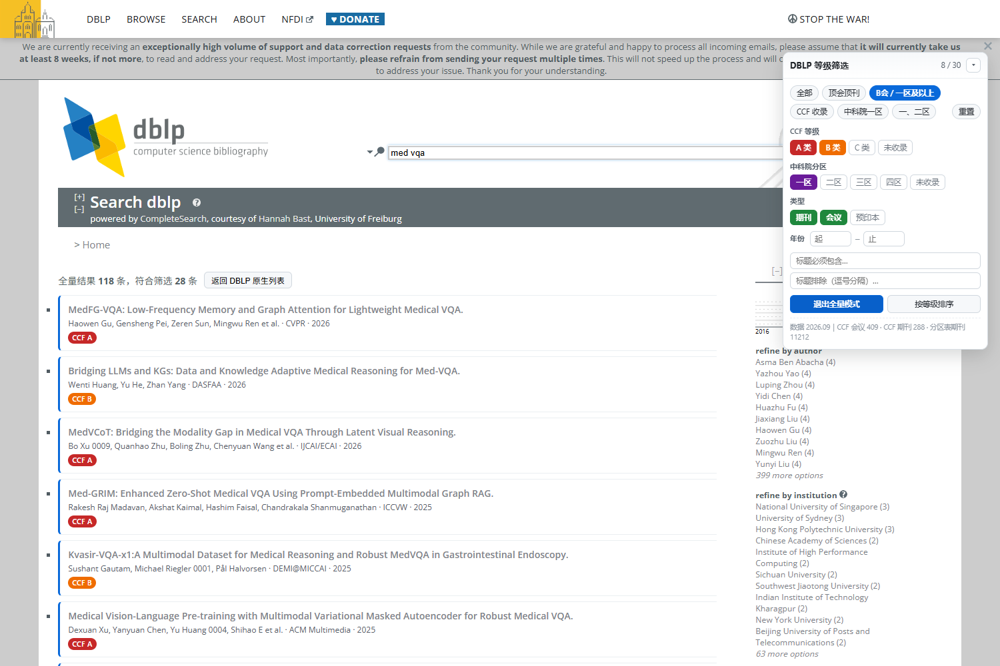

# DBLP 等级筛选器

在 [DBLP](https://dblp.org/) 搜索结果页给每篇论文标注 **CCF 推荐等级** 与 **中科院期刊分区**，并支持一键筛选出「顶会顶刊 / B会·一区及以上 / CCF 收录 / 一区」等目标论文。

解决的典型问题：在 <https://dblp.org/search?q=med+vqa> 这类搜索里，几十条命中混着大量 arXiv 预印本和低级别刊物，想快速只看 A 会 A 刊，或 B 会 / 一区以上。



---

## 快速开始

### 方式一：用户脚本（最省事，推荐）

1. 给浏览器装 [Tampermonkey](https://www.tampermonkey.net/)（油猴）或 Violentmonkey
2. 下载 **[`dblp-rank-filter/dblp-rank-filter.user.js`](dblp-rank-filter/dblp-rank-filter.user.js)**，拖进浏览器窗口，弹窗里点「安装」
3. 打开任意 DBLP 搜索页即可使用

> 这个文件是自包含的（等级库、样式、运行时代码全部内联），单独一个文件就能用。

### 方式二：Chrome / Edge 扩展

1. 下载仓库（`Code` → `Download ZIP`）或克隆到本地
2. 地址栏输入 `chrome://extensions`（Edge 为 `edge://extensions`）
3. 右上角打开 **开发者模式**
4. 点 **加载已解压的扩展程序**，选择 **`dblp-rank-filter`** 目录（即含 `manifest.json` 的那一层）
5. 打开任意 DBLP 搜索页，右上角出现筛选面板

扩展版额外提供工具栏弹窗（快速切换方案、一键开关）。

> 除「全量筛选」会调用 DBLP 官方 API 外，不做任何网络请求，也不需要账号。

---

## 使用

打开 <https://dblp.org/search?q=med+vqa>，页面右上角即为控制面板。每条结果后直接显示等级标签：

```
MedFG-VQA: Low-Frequency Memory and Graph Attention ...  CVPR 2026  [CCF A]
Du C., Zhang L., ... IEEE Trans. Medical Imaging 44(11) 2025  [CCF B] [中科院1区 Top]
```

### 预设方案（推荐直接用）

| 预设 | 含义 |
| --- | --- |
| 全部 | 不过滤，仅做标注 |
| 顶会顶刊 | CCF-A 类 **或** 中科院一区 |
| **B会 / 一区及以上** | CCF-A/B 类 **或** 中科院一区（默认） |
| CCF 收录 | 仅 CCF-A/B/C 类会议期刊（不看分区） |
| 中科院一区 | 仅中科院一区期刊 |
| 一、二区 | 中科院一区或二区期刊 |

### 细粒度条件

- **CCF 等级**：A / B / C / 未收录，可任意多选
- **中科院分区**：一区 ~ 四区 / 未收录，可任意多选
- **类型**：期刊 / 会议 / 预印本（默认不含预印本）
- **年份**：起止年份
- **标题**：必须包含某关键词 / 排除若干关键词（逗号分隔）
- **按等级排序**：把高等级论文排到前面

### 全量筛选（推荐）

DBLP 搜索默认每页 30 条、总共可能上百条，逐页筛很麻烦。

点 **「全量筛选（不限页）」**：通过 DBLP 官方 API 一次性取回全部命中（最多 1000 条），换成自建列表并按当前条件过滤，结果形如「全量结果 118 条，符合筛选 28 条」。点 **「返回 DBLP 原生列表」** 退出。

快捷键 **Alt + F** 收起 / 展开面板。



---

## 筛选逻辑

CCF 等级与中科院分区是 **或** 的关系：

> 一条论文只要 **CCF 等级命中** 或 **中科院分区命中** 就保留。

这样才符合「B会 / 一区及以上」的直觉。举例：

| 论文 venue | CCF | 中科院 | 「B会 / 一区及以上」 |
| --- | --- | --- | --- |
| CVPR | A | — | 保留（CCF A） |
| ECCV | B | — | 保留（CCF B） |
| MICCAI | B | — | 保留（CCF B） |
| IEEE TMI | B | 1区 Top | 保留 |
| Medical Image Analysis | **C** | 1区 Top | 保留（靠分区） |
| IEEE JBHI | C | 2区 Top | 不保留 |
| 某三区 SCI | 未收录 | 3区 | 不保留 |
| arXiv / CoRR | 预印本 | — | 不保留 |

注意 Medical Image Analysis 这类期刊：CCF 目录里它在「交叉/综合/新兴」是 **C 类**，但中科院分区是 **一区 Top**。所以按分区能被选出来，只按 CCF 则不会。

---

## 数据来源

| 数据 | 规模 | 来源 |
| --- | --- | --- |
| CCF 会议等级 | 409 个 venue | [ccfddl/ccf-deadlines](https://github.com/ccfddl/ccf-deadlines) + [WenyanLiu/CCFrank4dblp](https://github.com/WenyanLiu/CCFrank4dblp) |
| CCF 期刊等级 | 288 个 venue | 同上 |
| 中科院分区表 | 11212 本期刊 | 中科院文献情报中心期刊分区表（2025 升级版），经 [hitfyd/ShowJCR](https://github.com/hitfyd/ShowJCR) / [yuzhounh/Authoritative-Journal-Classification](https://github.com/yuzhounh/Authoritative-Journal-Classification) 整理 |

数据文件：`dblp-rank-filter/src/data/ranks.json`（可直接编辑）。

匹配方式有三层，逐层降级：

1. **DBLP 流键精确匹配**（`conf/cvpr`、`journals/tmi`）—— 最可靠
2. venue 展示名规范化后精确匹配
3. 词元前缀相似度模糊匹配
   （把 DBLP 的 `IEEE Trans. Medical Imaging` 对齐到分区表的 `IEEE Transactions on Medical Imaging`）

> 已修正上游数据的一处错误：`IJCAI` 在 ccf-deadlines 与 CCFrank 中都被标为 B，实际应为 **CCF A**（见《CCF 推荐国际学术会议·人工智能》A 类目录）。

---

## 已知限制

1. **只作用于 DBLP 搜索页**（`dblp.org/search*`、`dblp.uni-trier.de/search*`）。
2. **全量筛选上限 1000 条**（DBLP API 单次返回上限）。超过时会提示已截断。
3. **会议没有分区**：中科院分区表只覆盖期刊，会议只有 CCF 等级。
4. **DBLP 未收录的 venue 显示「未收录」**：例如 WACV、MIDL、TMLR 等在 CCF 目录里查不到，属正常情况。
5. 少数极不规范的 venue 缩写可能匹配不到分区表，会显示「未收录」。
6. CCF 等级为 2019 / 2022 / 2026 版目录的综合结果（例如 ICLR 已按最新目录计为 A 类）。

---

## 自定义等级数据

`dblp-rank-filter/src/data/ranks.json` 结构：

```jsonc
{
  "meta": { "version": "2026.09", ... },
  // CCF 会议/期刊：key 为 DBLP 流键
  "conf":    { "conf/cvpr": { "r": "A", "a": "CVPR", "f": "IEEE/CVF ...", "s": "AI" } },
  "journal": { "journals/tmi": { "r": "B", "a": "TMI", "f": "IEEE Transactions on Medical Imaging", "s": "" } },
  // 中科院分区表：n 名称 / q 分区 / t 是否 Top / c 大类
  "cas":     [ { "n": "IEEE Transactions on Medical Imaging", "q": 1, "t": 1, "c": "医学" } ]
}
```

- `r` = CCF 等级（A/B/C），`a` = 简称，`f` = 全称，`s` = CCF 分类
- 想调整某本期刊/会议，直接改对应条目，改完重新加载扩展

**最省事的覆盖方式**：只想给某个 venue 指定等级，在 `"conf"` 或 `"journal"` 里加一条即可，key 用 DBLP 流键（在 DBLP 记录页 URL 里能看到，形如 `journals/tmi`）。

改完 `ranks.json` 后，用户脚本版需要重新执行打包脚本才能生效（等级库是内联进去的）。

---

## 目录结构

```
.
├── README.md                  # 本文件
├── dblp-rank-filter/          # 插件本体（扩展版加载这个目录）
│   ├── README.md              # 详细说明
│   ├── dblp-rank-filter.user.js   # 用户脚本版（拖进油猴即可安装）
│   ├── manifest.json          # MV3 扩展清单
│   ├── popup.html / popup.js  # 工具栏弹窗
│   ├── icons/                 # 图标
│   └── src/
│       ├── rank-engine.js     # 等级匹配引擎（键匹配 / 名称匹配 / 模糊匹配）
│       ├── content.js         # 面板 UI、标注、筛选、全量筛选
│       ├── panel.css          # 样式（含深色模式）
│       └── data/ranks.json    # CCF + 中科院分区等级库
└── shot-*.png                 # 效果截图
```

> `tools/` 构建脚本与上游数据源快照未包含在本仓库中。

---

## 免责说明

等级数据整理自公开渠道，**仅供初筛参考**。投稿 / 毕业 / 评奖请以 CCF 官方目录与中科院文献情报中心发布的正式分区表为准。

---

## License

见 [LICENSE](LICENSE)。若尚未添加，默认保留所有权利。
